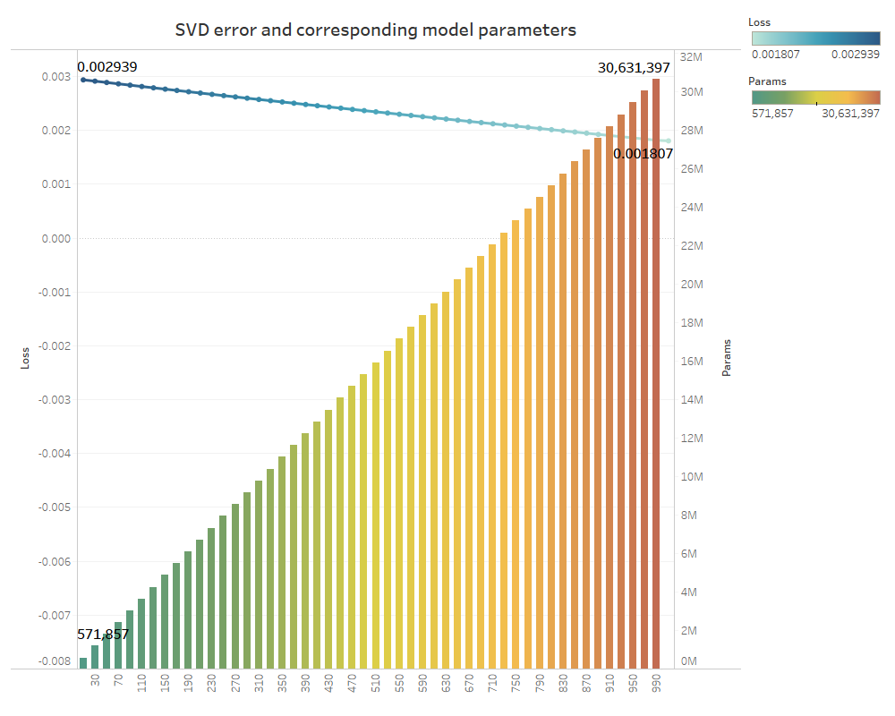

# ANOMALY BEHAVIOR DETECTION IN CROWD VIA LIGHTWEIGHT 3D MODEL

## Memory with Truncated Singular Value Decomposition

The following figure shows the comparison of the effect of choosing different truncation values on the number of parameters and the number of parameters. It can be seen that the effect of larger truncation values on the number of parameters is much larger than the effect of larger truncation values on the parameter values themselves. The effect of choosing a larger truncation value (the number of parameters in the Memory matrix decreases) is much larger than the effect of choosing a larger truncation value on the number of parameters. while preserving the important information of Memory.

## Parameter comparison and results

| Method | Params. | Accuracy | Recall | Precision | F1 | AUC |
| -------- | -------- | -------- | -------- | --------| -------- |
| SlowFast | 128.07M | 90.47 | 90.47 | 81.72 | 85.88 | 92.13 |
| X3D-M | 11.4M | 87.91 | 87.88 | 79.54 | 83.5 | 89.93 |
| I3D | 46.9M | 89.85 | 89.85 | 77.32 | 83.11 | 90.36 |
| C3D | 243.64M | 90.38 | 90.38 | 83.35 | 86.72 | 88.48 |
| LightW3D**(ours)** | 2.91M | 91.73 | 91.72 | 84.06 | 87.72 | 93.55 |
